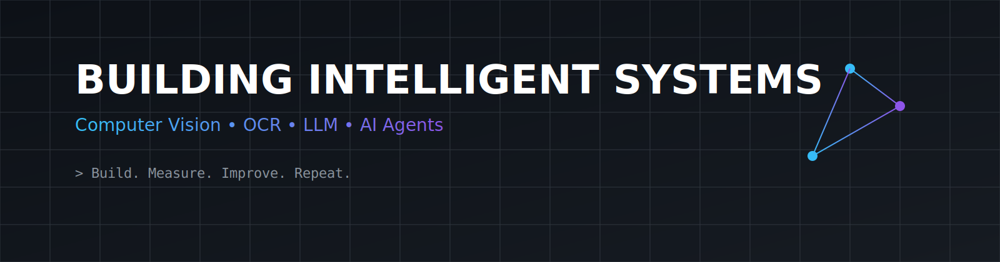

  

  

  
  
  

---

# 👋 About

I'm an AI developer who enjoys building **real-world intelligent systems** rather than standalone machine learning models.

My primary interests include:

- 👁️ Computer Vision
- 📄 OCR & Document Understanding
- 🤖 Large Language Models
- 🧠 AI Agents
- ⚡ Backend Engineering

Currently, I'm focusing on building production-ready AI applications using modern Python technologies.

---

# 🚀 Current Focus

<table>
<tr>

<td width="33%" align="center">

### 🤖 AI Agents

Tool Calling

Multi-Agent

Reasoning

</td>

<td width="33%" align="center">

### 👁️ Vision AI

OCR

YOLO

Image Processing

</td>

<td width="33%" align="center">

### ⚡ AI Backend

FastAPI

Docker

REST APIs

</td>

</tr>
</table>

---

## ⭐ Featured Projects

| Project | Description | Tech |
|---|---|---|
| CV Matching AI Agent | Resume parsing, OCR, RAG | Python, FastAPI, Gemini |
| AI Plays Flappy Bird | Neuroevolution | Python, NEAT |
| Mental Health Chatbot | RAG assistant | Gemini, LangChain |
| Movie Recommendation | ML recommender | Python, DBSCAN |

---

# 📊 GitHub Analytics

---

# 🐍 Contribution Snake

<picture>
<source media="(prefers-color-scheme: dark)" srcset="https://raw.githubusercontent.com/TPTN1707/TPTN1707/output/github-contribution-grid-snake-dark.svg">
<source media="(prefers-color-scheme: light)" srcset="https://raw.githubusercontent.com/TPTN1707/TPTN1707/output/github-contribution-grid-snake.svg">

</picture>

---

# 🛠 Tech Stack

### Languages
Python • JavaScript

### AI
PyTorch • TensorFlow • OpenCV • YOLO • Gemini

### Backend
FastAPI • Flask • Docker

### Tools
Git • GitHub • Linux • VS Code

---

# 🎯 Currently Exploring

- Multi-Agent Systems
- Model Context Protocol (MCP)
- LLM Evaluation
- Agentic RAG
- Production AI

---

# 💭 Engineering Philosophy

> Build first. Measure second. Improve forever.

---

# 📫 Connect

- GitHub: https://github.com/TPTN1707
- Email: tptnhan1491@gmail.com

---
